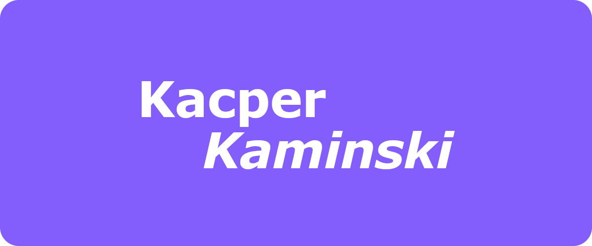

<h1 align="center">
    
</h1>

    I'm a developer from the UK

    
    

<h2 align="center">Workspace</h2>

    
    
    
    

    📫 Contact me at:
    <b>kacper@kaminski.ltd</b>

    
📃 CV

## Education
- 📖 **GCSE Computer Science**\
📆 2020 - 2022\
📍 Oldfield School and Sixth Form

- 📖 **A Level Computer Science**\
📆 2022 - 2024\
📍 Oldfield School and Sixth Form

## What I Know
<h3 align="center">🌐 Web Technologies</h3>

    
    
    
     
    
    
    
     
    
    
    
     
    
    
    
     
    
    
    

<h3 align="center">⚙️ System & Backend</h3>

    
    
    
     
    
    
    
     
    
    
    

<h3 align="center">🧠 AI/ML & Data Science</h3>

    
    
    
     
    
    

<h3 align="center">💻 Terminal</h3>

    
    
    
     
    

<!---
dxtrity/dxtrity is a ✨ special ✨ repository because its `README.md` (this file) appears on your GitHub profile.
You can click the Preview link to take a look at your changes.
--->
